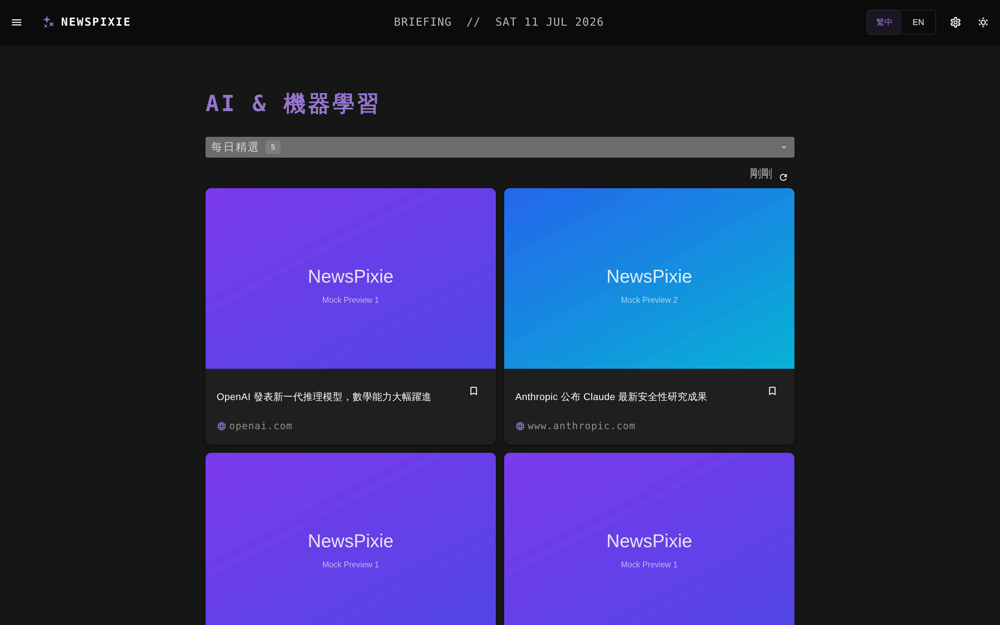
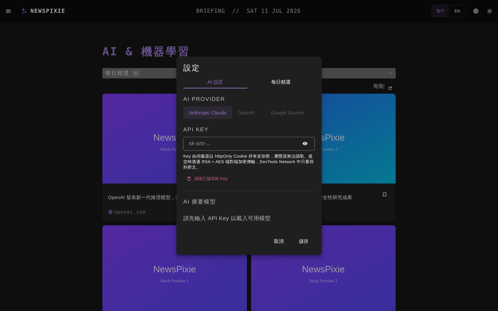
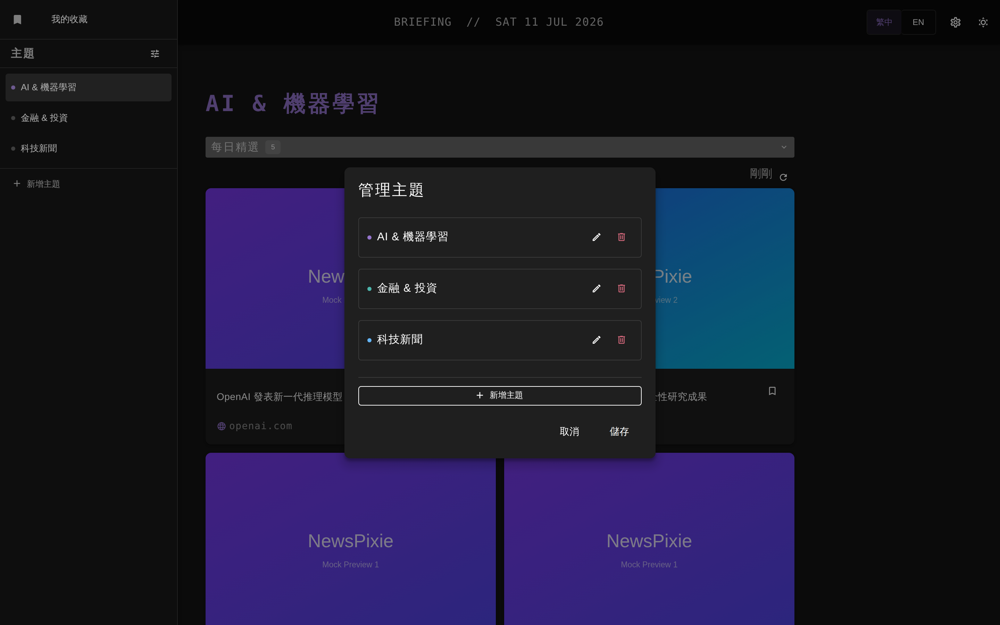

# ✨ NewsPixie

**AI 驅動的個人化每日新聞簡報儀表板** — 自訂追蹤主題,每天自動抓取、萃取、策展你關心的新聞與 GitHub 趨勢專案,由 AI 為你產出精選簡報。

🔗 **Live Demo:[https://news-pixie.vercel.app/](https://news-pixie.vercel.app/)**

> **NewsPixie** is an AI-powered personalized daily news briefing dashboard built with Nuxt 4 / Vue 3. Define the topics you care about, plug in your own AI API key, and it fetches news sources every day, uses AI to extract and curate the top articles, and surfaces trending GitHub repos — all wrapped in a clean dark/light UI with zh-TW / EN i18n. API keys are protected with hybrid RSA + AES end-to-end encryption and stored server-side in encrypted HttpOnly cookies.

---

## 目錄

- [功能特色](#功能特色)
- [如何使用](#如何使用)
- [畫面預覽](#畫面預覽)
- [架構簡介](#架構簡介)
- [技術棧](#技術棧)

---

## 功能特色

### 🤖 AI 每日簡報(Daily Briefing)

核心功能。針對每個主題,系統每天自動執行四階段 pipeline:

1. **抓取** — 透過 [Jina Reader](https://jina.ai/reader/) 將你設定的新聞來源網頁轉為 Markdown
2. **萃取** — AI 解析頁面內容,過濾導覽列/廣告/登入連結,萃取出真實的文章標題與連結
3. **策展** — AI 依主題關鍵字挑選最相關的 Top N 篇文章(可設定 4–10 篇),自動去除重複
4. **縮圖** — 平行抓取每篇文章的 Open Graph 圖片作為卡片預覽

結果以每日快取保存,可設定每天自動觸發的時間(預設 07:00),也可以隨時手動重新整理。

### 🔑 自帶 AI API Key(BYO Key)

> ⚠️ **目前僅開放 Anthropic Claude API Key**,OpenAI 與 Google Gemini 選項待開放中(程式端介接已完成,UI 暫時停用)。

不需註冊帳號 — 在設定中貼上你自己的 API Key 即可開始使用,模型清單會即時從供應商 API 取得。

### 🔐 API Key 安全機制

你的 API Key 從送出到儲存全程加密,瀏覽器端不留明文:

- **端對端加密上傳**:前端以 AES-256-GCM 加密 payload,再用伺服器的 RSA-2048 公鑰(RSA-OAEP)包裝 AES 金鑰 — DevTools Network 面板只看得到密文
- **伺服器端加密儲存**:Key 存放在加密的 **HttpOnly Cookie**(30 天、SameSite Strict),前端 JavaScript 完全無法讀取
- UI 僅顯示遮罩後的 Key 尾碼(`••••abcd`),可隨時一鍵清除

### 📚 自訂主題管理

- 建立任意數量的追蹤主題,自訂名稱、代表色
- 每個主題可設定:**新聞來源網址**(任何網站的文章列表頁)、**篩選關鍵字**(AI 策展依據)、**GitHub 搜尋關鍵字**
- 內建三個預設主題:AI & 機器學習、金融 & 投資、科技新聞

### ⭐ GitHub 趨勢專案

依主題的 GitHub 關鍵字,自動搜尋**近 7 天內新建且最熱門**的 repo,顯示星數、fork 數、語言,並由 AI 改寫專案描述讓它更易讀。

### 🔖 書籤收藏

文章與 repo 都能一鍵收藏,獨立的收藏頁支援「全部 / 文章 / Repo」篩選,並標示來源主題。

### 🌗 其他

- 深色 / 淺色主題切換
- 繁體中文 / English 雙語介面(`@nuxtjs/i18n`)
- 響應式設計,行動裝置適用

---

## 如何使用

1. **開啟網站** — 前往 [https://news-pixie.vercel.app/](https://news-pixie.vercel.app/)
2. **設定 API Key** — 點右上角 ⚙️ 齒輪開啟設定:
   - 選擇 AI Provider(目前僅開放 **Anthropic Claude**,其餘待開放)
   - 貼上你的 API Key(至 [Anthropic Console](https://console.anthropic.com/) 申請)
   - 選擇要使用的模型後儲存 — Key 會經端對端加密送出,存於你自己瀏覽器的加密 HttpOnly Cookie,**不會被該專案作者本人或任何第三方讀取**
3. **管理主題** — 開啟左側選單,新增或編輯主題:填入主題名稱、想追蹤的新聞來源網址、篩選關鍵字與 GitHub 搜尋關鍵字
4. **閱讀簡報** — 每天設定時間後開啟頁面會自動產生當日簡報,也可點 🔄 手動更新;點卡片開啟原文,點 🔖 收藏
5. **調整偏好** — 設定中的「每日精選」分頁可調整自動觸發時間、每主題文章數(4–10)與 repo 數(4–10)

---

## 畫面預覽

| 設定(AI Provider 與 Key 管理) | 主題管理 |
| :---: | :---: |
|  |  |

---

## 架構簡介

- **SPA 架構**(`ssr: false`)+ **Nitro Server API** 作為後端 proxy:所有 AI 呼叫、網頁抓取、GitHub 搜尋都經由 server 端點執行,前端不直接接觸外部 API 與金鑰
- **狀態管理**:Pinia stores(主題 / 設定 / 書籤)持久化至 localStorage;簡報結果以每日快取保存
- **AI 供應商抽象層**:統一的 client 介面支援 Anthropic / OpenAI / Gemini 三家 REST API
- **Mock 模式**:單一環境變數切換為全套假資料,方便展示與測試

> 完整系統架構、加密流程與資料流細節請見 [arc24.md](docs/arc24.md)。

---

## 技術棧

| 分類 | 技術 |
| --- | --- |
| 框架 | Nuxt 4、Vue 3、TypeScript |
| UI | Vuetify 4、Material Design Icons |
| 狀態 | Pinia + persisted state |
| 國際化 | @nuxtjs/i18n(zh-TW / EN) |
| AI | Anthropic Claude(OpenAI、Gemini 待開放) |
| 資料來源 | Jina Reader、GitHub Search API、Open Graph |
| 測試 | Vitest、Playwright |
| 部署 | Vercel |

---

## 作者

由 [Kevin Yu](https://github.com/KevinYu1580) 開發。
